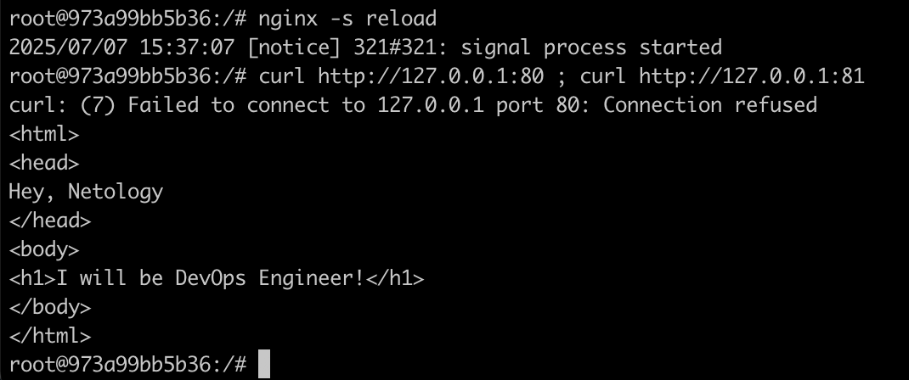

## Задача 1
https://hub.docker.com/repository/docker/azhdarmamedov/custom-nginx/general

## Задача 2
1. 

2. 

3. 

4. 

## Задача 3
1. 
2-3. Так произошло, потому что у каждого контейнера есть свой процесс и командой Ctrl + C мы посылаем сигнал SIGINT для его завершения
![Docker_Ctrl+c] (images/images/task3_docker_run.png)
5-6. 
7. Отредактировал
8. 
10. Nginx теперь слушаем порт 81, а ранее я пробрасывал порт 8080 ВМ на 80 docker, это можно видеть в docker ps:
973a99bb5b36   azhdarmamedov/custom-nginx:1.0.0   "/docker-entrypoint.…"   10 minutes ago   Up 10 minutes   0.0.0.0:8080->80/tcp, [::]:8080->80/tcp   pensive_darwi
11. Можно сделать новый коммит на основе коммита текущего контейнера (docker commit) и запустить этот новый контейнер с новым пробросом портов (8081:81)
12. rikolleti@compute-vm-2-2-30-hdd-1751355561681:~$ docker rm -f confident_agnesi
confident_agnes

## Задача 4
1. 
2. 
3. 
4. 
5. 

## Задача 5
1. Был использован файл compose.yaml, так как он является более предпочтительным, так как файл docker-compose.yaml используется для обратной совместимости с более ранними версиями.

2. 
3. 
4. 